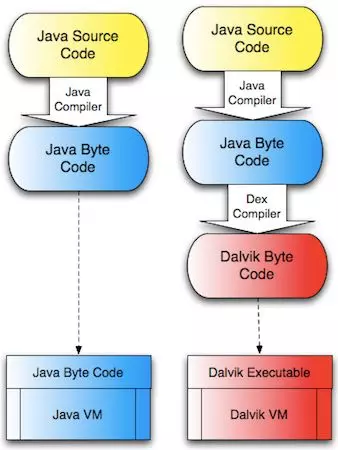
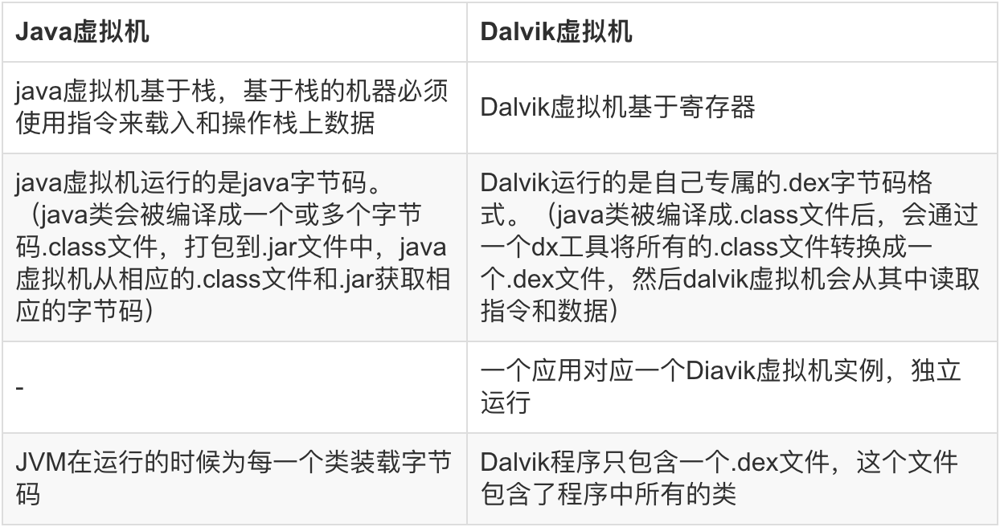

# JVM、Dalvik 和 Art 的区别

**JVM 和 Dalvik 工作流程**

**JVM 和 DVM 区别**

**Art 虚拟机**

即 Android Runtime，Android 4.4 发布了一个 ART 运行时，准备用来替换掉之前一直使用的 Dalvik 虚拟机。
ART 的机制与 Dalvik 不同。在 Dalvik 下，应用每次运行的时候，字节码都需要通过即时编译器（just in time ，JIT）转换为机器码，这会拖慢应用的运行效率，而在 ART 环境中，应用在第一次安装的时候，字节码就会预先编译成机器码，使其成为真正的本地应用。这个过程叫做**预编译**（AOT, Ahead-Of-Time ）**当然应用的安装时间会变长**。不过这样的话，**应用的启动(非首次)和执行都会变得更加快速。**

**Dalvik与Art的区别**

1. Dalvik 每次都要编译再运行，Art 只会首次启动编译
2. Art 占用空间比 Dalvik 大（原生代码占用的存储空间更大），就是用「**空间换时间**」
3. Art 减少编译，减少了 CPU 使用频率，使用明显改善电池续航
4. Art 应用启动更快、运行更快、体验更流畅、触感反馈更及时