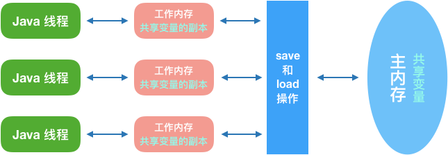

# Java 内存模型

和**并发编程**有关。

- 硬件的效率与一致性

    物理计算机中的并发与虚拟机中的情况有不少相似之处

    - 让计算机并发执行若干个运算任务，以能够充分利用计算机处理器的效能。然而绝大多数运算任务除了需要处理器计算之外，还需要「处理器」和「内存」交互。由于存储设备与处理器的运算速度有几个数量级的差距，所以现代计算机系统会在两者直接加一层读写速度尽可能接近于处理运算速度的「高速缓存（cache）」，来作为两者之间的缓冲。
    - 然而高速缓存却因此引入一个新的问题：**缓存一致性**，在多处理器系统中，每个处理器都有自己的高速缓存，而它们又共享同一「主内存」（MainMemory）。当多个处理器的运算任务都涉及同一块主内存区域时，将可能导致各自的缓存数据不一致，如果真的发生这种情况，那同步回到主内存时以谁的缓存数据为准呢？
    - 为了解决缓存一致性问题，引入一致性协议，而**内存模型则是在这个一致性协议下，对特定的内存或高速缓存进行读写访问过程的抽象**。

        

    - 除了增加高速缓存之外，为了使得处理器内部的运算单元能尽量被充分利用，处理器可能会对输入代码进行乱序执行（OutOfOrderExecution）优化，处理器会在计算之后将乱序执行的结果重组，保证该结果与顺序执行的结果是一致的，但并不保证程序中各个语句计算的先后顺序与输入代码中的顺序一致，因此，如果存在一个计算任务依赖另外一个计算任务的中间结果，那么其顺序性并不能靠代码的先后顺序来保证。与**处理器的乱序执行优化**类似，Java虚拟机的即时编译器中也有类似的**指令重排序**（InstructionReorder）优化。

### 主内存与工作内存

**Java 内存模型**是根据英文Java Memory Model（JMM）翻译过来的。其实JMM**只是一个抽象的概念**，并不像JVM内存结构一样是真实存在的。

- 主内存 - 共享内存
在 JVM 的内存结构的图中，我们可以看到，其中「Java 堆」和「方法区」的区域是多个线程共享的数据区域。也就是说，多个线程可能可以操作保存在堆或者方法区中的同一个数据。这也就是我们常说的：**Java的线程间通过共享内存（主内存）进行通信。**
- 工作内存 - 本地内存
每条线程还有自己的工作内存（WorkingMemory，可与前面讲的处理器高速缓存类比），线程的工作内存中保存了被该线程使用到的变量的**主内存副本拷贝。**线程对变量的所有操作（读取、赋值等）都必须在工作内存中进行，而不能直接读写主内存中的变量。
本地内存是一个抽象概念，它涵盖了缓存、写缓存区、寄存器以及其他的硬件和编译器优化。

而由于采用共享内存进行通信，在通信过程中会存在一系列如**可见性、原子性、有序性**等问题，而**JMM 就是围绕着多线程通信以及与其相关的一系列特性而建立的模型**。JMM定义了一些语法集，这些语法集映射到 Java 语言中就是volatile、synchronized 等关键字。

### 先行发生，happens-before

在执行程序时，为了提高性能，编译器和处理器常常会对指令做重排序。在多线程中重排序会对程序的执行结果有影响。JSR-133内存模型采用 happens-before的概念来阐述操作之间的内存可见性。**happens-before 会限制重排序以满足规则**。主要的happens-before 规则有如下：

- 程序顺序规则：一个线程中的每个操作，happens-before 于该线程中的任意后续操作。
- 监视器锁规则：对一个锁的解锁，happens-before与锁随后对这个锁的加锁。
- volatile 变量规则：对一个volatile域的写，happens-before于任意后续对这个volatile域的读。
- 传递性：如果A happens-before B，且B happens-before C，那么A happens-before C。