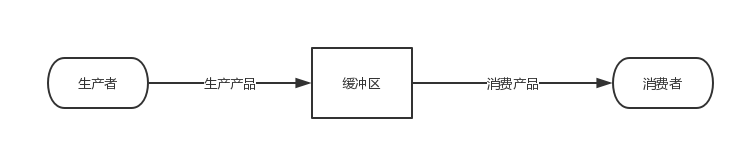

# 生产者消费者

生产者和消费者问题是线程模型中的经典问题：

- 生产者和消费者在同一时间段内共用同一个存储空间。生产者往存储空间中添加产品，消费者从存储空间中取走产品
- 当存储空间为空时，消费者阻塞；当存储空间满时，生产者阻塞。

    

**5 种方式实现生产者消费者模型**

1. wait() / notify()
2. 可重入锁 ReentrantLock
3. 阻塞队列 BlockingQueue
4. 信号量 Semaphore
5. 管道输入输出流 PipedInputStream 和 PipedOutputStream