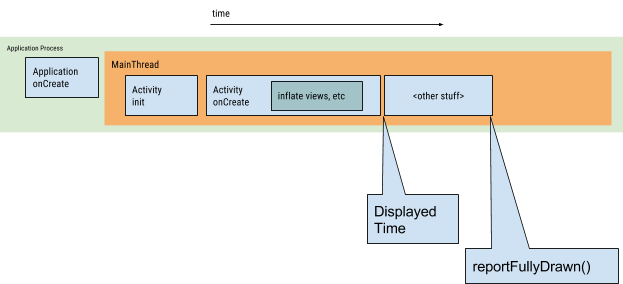

# 冷启动优化

从进程角度上讲，**冷启动**就是在启动应用前，系统中没有该应用的任何进程信息 (包括 Activity、Service 等) 。

所以，冷启动产生的场景就很容易理解了，

- 比如设备开机后应用的第一次启动，
- 系统杀掉应用进程 (如：系统内存吃紧引发的 kill 和 用户主动产生的 kill) 后 的再次启动等。

应用发生冷启动时，**系统**有三件任务要做：

1. 开始加载并启动应用；
2. 应用启动后，显示一个空白的启动窗口；
3. 创建应用进程信息；

系统创建应用进程后，**应用**就要做下面这些事情：

1. 初始化应用中的对象 (比如 Application 中的工作)；
2. 启动主线程 (UI 线程) ；
3. 创建第一个 Activity；
4. 加载内容视图 (Inflating) ；
5. 计算视图在屏幕上的位置排版 (Laying out)；
6. 绘制视图 (draw)。

只有当应用完成第一次绘制，系统当前展示的空白背景才会消失，才会被 Activity 的内容视图替换掉。也就是这个时候，用户才能和我们的应用开始交互。下图展示了冷启动过程系统和应用的一个工作时间流：

开发人员唯一能做的就是

1. 减少 `Applicaton#onCreate()` 的工作量
    1. 初始化的第三方 SDK，可以通过
        1. 懒加载的方式。如果允许的话，在真正需要使用此 SDK 的时候再初始化
        2. 异步加载。如果允许的话，放在异步线程中加载
    2. 减少不必要的全局变量
2. 减少第一个 `Activity#onCreate()` 的工作量
    1. 优化布局耗时：一个布局层级越深，里面包含需要加载的元素越多，就会耗费更多的初始化时间。
    - 异步延迟加载：一开始只初始化最需要的布局，异步加载图片，非立即需要的组件可以做延迟加载。
3. 避免启动闪屏页的白屏
    1. 自定义一张图片，把这张图片通过设置主题的方式显示为启动闪屏，代码执行到主页面的 onCreate 的时候设置为程序正常的主题。
    2. 使用与主界面 UI 框架一致的 placeholder 内容，这种情况下需要计算诸如 Statusbar、Toolbar 控件的高度。然后同样通过设置主题的方式