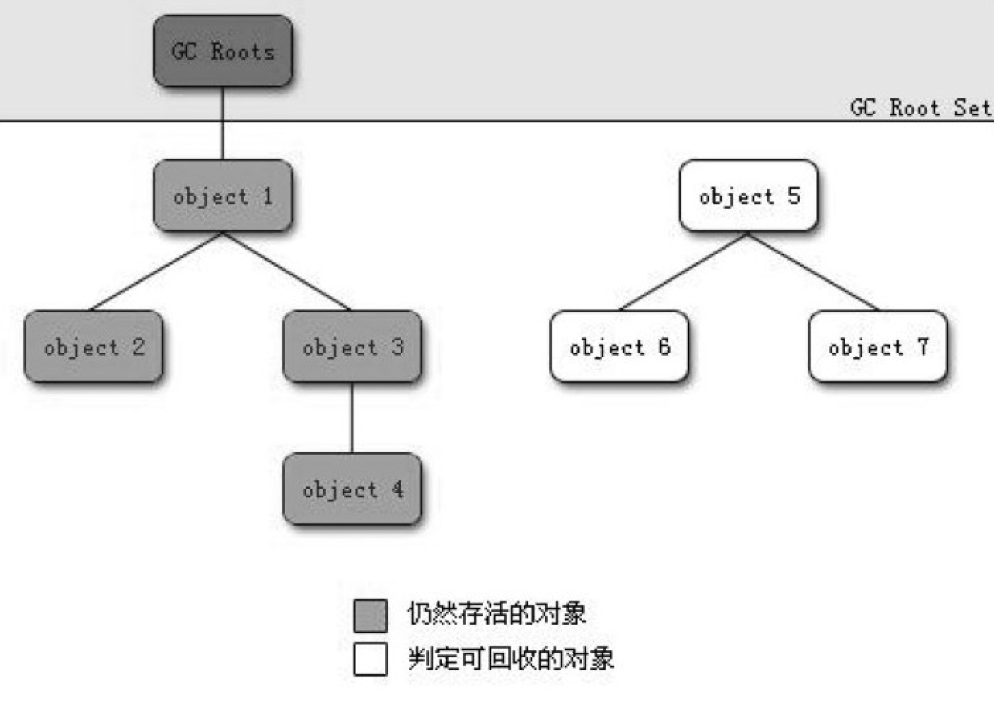
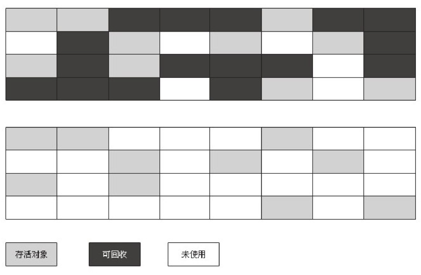
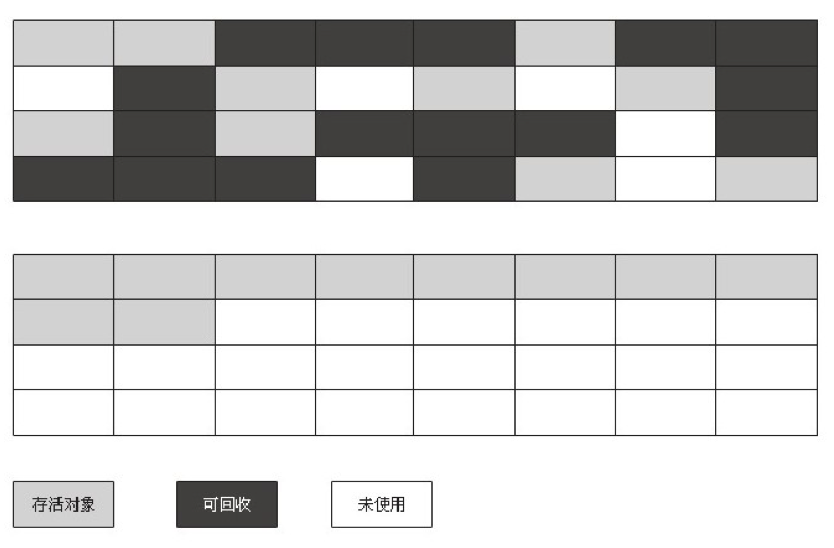
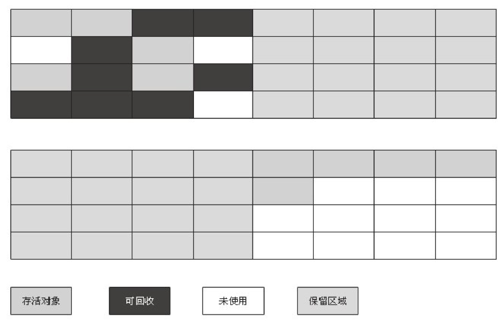

# Java 垃圾回收机制

### 一、什么是 Java 堆内存

堆内存在 JVM 启动时创建的，主要用来**维护运行时数据**，如运行时创建的对象及数组都是基于这一块内存空间。Java 堆是非常重要的元素，如果我们动态创建的对象没有得到及时回收，持续堆积，会导致堆空间被占满，内存溢出。
因此，Java 提供了一种**垃圾回收机制**，在**后台创建守护进程**，该进程会在内存紧张的时候自动跳出来，把堆空间的垃圾全部进行回收，从而保证程序的正常运行。

### 二、什么是垃圾

指不再存活的对象，常见的判断是否存活有两种方法：

- **引用计数法**：为每一个创建的对象分配一个计数器，用来存储该对象被引用的个数。当个数为 0，就意味着该对象没有被使用了，可以认为 “对象死亡”。此方法会有严重的问题，无法检测 **循环引用**（两个对象互相引用，都不被外界任何对象引用，它俩的计数都不为 0，因此永远不会被回收）。因此，Java 没有采用此方案
- **可达性分析**：主流语言所采用的方案。把所有引用的对象想象成一棵树，从树的根节点 **GC Roots** 出发，持续遍历所有连接的树枝对象，这些对象被称为 **可达对象**（存活对象），其余的对象则被视为 “死亡” 的 **不可达对象**（垃圾）

可达性分析算法判定对象是否可回收

### 三、GC Roots 指谁？

**GC Roots 本身一定是可达的**，这样从它出发遍历到的对象才能保证一定可达。Java 中一定可达的有以下四种：

- 虚拟机栈（帧栈中的本地变量表）中引用的对象，
- 方法区静态属性引用的对象
- 方法区常量引用的对象
- 本地方法栈中 JNI （Native 方法）引用的对象

### 四、垃圾回收方式

- **标记-清理**
    - 标记：利用可达性遍历堆内存，把 “存活” 的对象和 “垃圾” 对象进行标记
    - 清理：“垃圾”已经标记好了，再遍历一遍，把所有 “垃圾” 对象所占的空间直接清空即可

    简单方便，但是它的主要不足有两个：一个是效率问题，标记和清理两个过程的效率都不高；另一个是空间问题，标记清除之后会产生大量不连续的内存碎片，空间碎片太多可能会导致以后在程序运行过程中需要分配较大对象时，无法找到足够的连续内存而不得不提前触发另一次垃圾收集动作

    

- **标记-整理**

    上一种方法，清理的时候，把所有存活对象扎堆到同一个地方，让它们待在一起，这样就没有内存碎片了

    

- **复制**

    直接把堆内存分成两部分，一段时间内只允许在其中一块内存上进行分配，当这块内存被分配完以后，则执行垃圾回收，把所有存活的对象复制到另一块内存上，当前内存则直接清空。

    这样使得**每次都是对整个半区进行内存回收**，内存分配时也就不用考虑内存碎片等复杂情况，只要**移动堆顶指针**，按顺序分配内存即可，实现简单，运行高效。只是这种算法是将内存缩小为了原来的一半，未免代价太高了一点。

    

### 五、Java 分代回收机制

Java 的堆结构：

- **新生代**：刚刚创建的对象，这些新创建的对象会被统一放在一起。有很多局部变量等在新创建后很快会变成不可达对象，快速死去，因此这块区域的特点是 **存活对象少，垃圾多**
因此采用 **复制算法** 进行回收：把内存按 **8:1:1** 划分，依次取名为 **Eden(伊甸园)、SurvivorA(幸存者)、SurvivorB(幸存者)**，工作原理如下
    1. Eden 区最大，对外提供堆内存，当 Eden 区快满了，则进行 Minor GC，把存活对象放入 SurvivorA 区，清空 Eden 区，Eden 区继续对外提供堆内存
    2. 当 Eden 区再次被填满，此时对 Eden 区和 SurvivorA 区同时进行 Minor GC，把存活对象放入 SurvivorB 区，同时清空 Eden 区和 SurvivorA 区
    3. Eden 区继续对外提供内存，并重复上述过程，即在 Eden 区填满后，把 Eden 区和 Survivor 区存活的对象放入另一个 Survivor 区
    4. 当某个 Survivor 区被填满以后，仍有对象未被复制完毕，或者某些对象在反复 Survive 15 次左右时，则把这部分剩余对象放入老年代；
    5. 当老年代也被填满后，进行 Major GC，对老年代进行垃圾回收
    在真实的 JVM 环境里，可以通过参数 SurvivorRatio 手动配置 Eden 区和单个 Survivor 区的比例，默认为 8
- **老年代**：存活了一段时间的对象。这些对象早早就被创建了，而且一只活下来，把它们放在一起。这块区域的特点是 **存活对象多，垃圾少**
因此采用 **标记 - 整理** 回收机制
- **持久代**：存放一些不需要垃圾回收，永远存活的对象，比如静态文件（Java 8 删除了，把这块内存空间给了元空间）

### 六、GC（垃圾收集器）

如果说收集算法是内存回收的方法论，那么**垃圾收集器就是内存回收的具体实现**。

**新生代**收集器使用的收集器：Serial、PraNew、Parallel Scavenge

**老年代**收集器使用的收集器：Serial Old、Parallel Old、CMS

**Serial 收集器（复制算法)**

新生代单线程收集器，标记和清理都是单线程，优点是简单高效。

**Serial Old 收集器(标记-整理算法)**

老年代单线程收集器，Serial 收集器的老年代版本。

**ParNew收集器(停止-复制算法)**

新生代收集器，可以认为是 Serial 收集器的多线程版本,在多核 CPU 环境下有着比 Serial 更好的表现。

**Parallel Scavenge 收集器(停止-复制算法)**

并行收集器，追求高吞吐量，高效利用 CPU。吞吐量一般为 99%， 吞吐量=用户线程时间/(用户线程时间+ GC 线程时间)。适合后台应用等对交互相应要求不高的场景。

**Parallel Old 收集器(停止-复制算法)**

Parallel Scavenge 收集器的老年代版本，并行收集器，吞吐量优先

**CMS(Concurrent Mark Sweep) 收集器（标记-清理算法）**

高并发、低停顿，追求最短 GC 回收停顿时间，cpu 占用比较高，响应时间快，停顿时间短，多核 cpu 追求高响应时间的选择

### 七、GC 的执行机制

由于对象进行了分代处理，因此垃圾回收区域、时间也不一样。GC 有两种类型：Scavenge GC 和 Full GC。

**Scavenge GC**

一般情况下，当新对象生成，并且在 Eden 申请空间失败时，就会触发 Scavenge GC，对 Eden 区域进行 GC，清除非存活对象，并且把尚且存活的对象移动到Survivor 区。然后整理 Survivor 的两个区。这种方式的 GC 是对年轻代的 Eden 区进行，不会影响到年老代。因为大部分对象都是从 Eden 区开始的，同时 Eden 区不会分配的很大，所以 Eden 区的 GC 会频繁进行。因而，一般在这里需要使用速度快、效率高的算法，使 Eden 去能尽快空闲出来。

**Full GC（Major GC）**

对整个堆进行整理，包括 Young、Tenured 和 Perm。Full GC因为需要对整个堆进行回收，所以比 Scavenge GC 要慢，因此应该尽可能减少 Full GC 的次数。在对JVM 调优的过程中，很大一部分工作就是对于 FullGC 的调节。有如下原因可能导致 Full GC：

1. 年老代（Tenured）被写满
2. 持久代（Perm）被写满
3. `System.gc()` 被显示调用
4. 上一次 GC 之后 Heap 的各域分配策略动态变化

### 八、Java 有了 GC 同样会出现内存泄漏

[内存泄漏](https://www.notion.so/4cea87e0-5939-4e08-92ac-631a7828bd24)