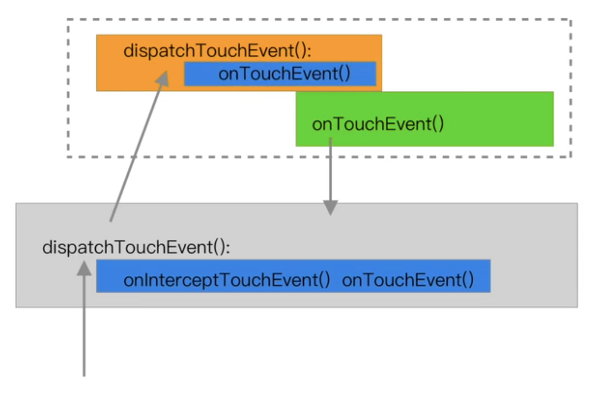

# 触摸反馈和事件分发

### 一、**View 的触摸反馈**

一般来说，都是重写 `View#onTouchEvent()` 来在方法内部定制触摸反馈算法

- 是否消费事件取决于 `ACTION_DOWN` 事件或 `POINTER_DOWN` 事件是否返回 `true`
- `MotionEvent` 的两个处理方法
    1. `getAction()` 是比较老的方法
    2. `getActionMasked()` ，比第 1 种多了「多点触控」，所以一般情况用这一种就可以了
        - `POINTER_DOWN`、`POINTER_UP`
        - `getActionIndex()` 代表多点触控的第几根手指

**View#onTouchEvent()** **源码分析**

1. 通过 `event.getX()`、`event.getY()` 来获得触摸事件的 x、y 坐标
2. viewFlags、View 的状态
3. 判断触摸事件的类型：`event.getAction()`
4. View 的点击状态：`boolean clickable`
    1. `CLICKABLE`，可点击
    2. `LONG_CLICKABLE`，长按
    3. `CONTEXT_CLICKABLE`，上下文可点击。用于老式手机的菜单按键
5. 如果当前的 `viewFlags` 是 `DISABLE`，那么整个方法直接返回 `clickable` 的值。View 是 Disable 状态，该消费事件，还是要消费的​
6. `TouchDelegate`，触摸事件代理，用于增大 View 的可点击范围。一般这种需求，通过 UI 的设计来解决，用不上这个东西
7. 如果 `clickable` 为 `true`，消费了触摸事件；或者 `viewFlags` 是 `TOOLTIP`，就进入各种 `action` 的判断。TOOLTIP 就是提示文字，长按 View，可以在点击的位置上方一直显示这个提示文字。
    1. **ACTION_DOWN**

            **// 判断是不是「手指」触摸到了屏幕，
            // 除了手指，还有可能是键盘，比如 Android TV**
            if (event.getSource() == InputDevice.SOURCE_TOUCHSCREEN) {
            	  mPrivateFlags3 |= PFLAG3_FINGER_DOWN;
            }
            mHasPerformedLongPress = false;
            
            if (!clickable) { **// 如果 clickable 为 false，**
            	  checkForLongClick(0, x, y); **// 设置一个「长按等待器」**
            		break;
            }
            
            if (performButtonActionOnTouchDown(event)) { **// 鼠标右键触发了上下文菜单**
            	  break;
            }
            
            **// 是否在滑动控件里**
            boolean isInScrollingContainer = **isInScrollingContainer**();
            
            
            if (isInScrollingContainer) {
            	  mPrivateFlags |= PFLAG_PREPRESSED; **// 先设置为「预按下」状态**
            	  if (mPendingCheckForTap == null) {
            				**// 然后再设置一个「按下等待器」**
            	      mPendingCheckForTap = new CheckForTap(); 
                }
                mPendingCheckForTap.x = event.getX();
                mPendingCheckForTap.y = event.getY();
            		**// delay getTapTimeOut == 100ms 后再设置为按下状态和长按等待器**
                postDelayed(mPendingCheckForTap, ViewConfiguration
            			.getTapTimeout()); 
            } else {
            		setPressed(true, x, y); **// 设置为按下状态**
                checkForLongClick(0, x, y); **// 设置一个长按等待器**
            }

        重点：`isInScrollingContainer()`，Android 的特性是，在滑动控件里，不知道此次的触摸是要「按下」，还是为了滑动，所以需要 delay 一下再判断

            public boolean isInScrollingContainer() {
                ViewParent p = getParent();
                while (p != null && p instanceof ViewGroup) {
                    if (((ViewGroup) p).**shouldDelayChildPressedState()**) {
                        return true;
                    }
                    p = p.getParent();
                }
                return false;
            }

        返回值关键在于 `**shouldDelayChildPressedState()**`，默认值为 `**true**`，如果继承至 `ViewGroup` 的 layout 是不可滑动的，那么最好重写这个方法，改为返回 `**false**`，这样 `ACTION_DOWN` 的时候就不用等待一个 delay 了，也就是**不会卡顿 100ms**

    2. **ACTION_MOVE**

            if (clickable) {
            		drawableHotspotChanged(x, y); **// 水波纹效果**
            }
            
            **// 如果手指移出了触摸的 View，则结束
            // mTouchSlop，触摸溢出，手指移动多少才算是 MOVE，默认值 8**
            if (!pointInView(x, y, mTouchSlop)) { 
                removeTapCallback(); **// 移除「预按下」等待器**
                removeLongPressCallback(); **// 移除长按等待器**
            	  if ((mPrivateFlags & PFLAG_PRESSED) != 0) {
            		    setPressed(false); **// 按下状态置为 false**
                }
            	  mPrivateFlags3 &= ~PFLAG3_FINGER_DOWN;
            }

    3. **ACTION_UP**

            mPrivateFlags3 &= ~PFLAG3_FINGER_DOWN;
            if ((viewFlags & TOOLTIP) == TOOLTIP) {
            		handleTooltipUp(); **// 1.5s 后，让 TOOLTIP 消失**
            }
            if (!clickable) {
            		**// 不可点击，则所有状态置为空**
                break;
            }
            
            boolean prepressed = (mPrivateFlags & PFLAG_PREPRESSED) != 0;
            if ((mPrivateFlags & PFLAG_PRESSED) != 0 || prepressed) {    
                boolean focusTaken = false;
                if (isFocusable() && isFocusableInTouchMode() && !isFocused()) {
                    focusTaken = requestFocus();
            	  }
            
            		if (prepressed) {
            				**// 如果是「预按下」状态，则设置为「按下」状态**
                    setPressed(true, x, y);
                }
            
            		if (!mHasPerformedLongPress && !mIgnoreNextUpEvent) {
                    removeLongPressCallback();
            	      if (!focusTaken) {
            	          if (mPerformClick == null) {
            								**// 处理点击事件**
            	              mPerformClick = new **PerformClick**(); 
            	          }
            	          if (!post(mPerformClick)) {
            	              performClick();
            	          }
            		    }
            		}
            
            		if (mUnsetPressedState == null) {
            			  mUnsetPressedState = new UnsetPressedState();
            		}
            		
            		if (prepressed) {
            				**// 如果是「预按下」状态，则人为的加上一个延迟 64ms，再显示抬起的反馈**
            				// 因为抬起是一瞬间的
            			  postDelayed(mUnsetPressedState,
            		          ViewConfiguration.getPressedStateDuration());
            		} else if (!post(mUnsetPressedState)) {
            			  // If the post failed, unpress right now
            			  mUnsetPressedState.run();
            		}
            		removeTapCallback();
            }
            mIgnoreNextUpEvent = false;

    4. **ACTION_CANCEL**

        所有状态、属性置为空，移除所有的等待器

            if (clickable) {
                setPressed(false);
            }
            removeTapCallback();
            removeLongPressCallback();
            mInContextButtonPress = false;
            mHasPerformedLongPress = false;
            mIgnoreNextUpEvent = false;
            mPrivateFlags3 &= ~PFLAG3_FINGER_DOWN;
            break;

---

### 二、ViewGroup 的触摸反馈

- `ViewGroup#onInterceptTouchEvent()` ****先触发，再是子 `View#onTouchEvent()`，最后才是 `ViewGroup#onTouchEvent()`
- `ViewGroup#onInterceptTouchEvent()` 用于每一个事件的拦截。可以提前设置好条件，来抢占子 View 的事件以及后续所有事件，交给自己的 onTouchEvent() 来处理
- 重写 `ViewGroup#onInterceptTouchEvent()`，必定要重写 `ViewGroup#onTouchEvent()`主要是重写 ViewGroup 的 onTouchEvent()，因为还是这个方法来处理触摸反馈的各种事件

---

### 三、触摸反馈的流程

**dipachTouchEvent() 解析**

1. View 的 `dispatchTouchEvent()`
    - 如果设置了 `OnTouchListener`，调用 `OnTouchListener.onTouch()`
        - 如果 `OnTouchListener` 消费了事件，返回 `true`
        - 如果 `OnTouchListener` 没有消费了事件，则继续调用自己的 `onTouchEvent()` 事件，并返回 `onTouchEvent()` 相同的结果
    - 如果没有设置 `OnTouchListener`，则调用自己的 `onTouchEvent()` 事件，并返回 `onTouchEvent()` 相同的结果
2. ViewGroup 的 `dispatchTouchEvent()`

    

    - 如果自己的 `onInterceptTouchEvent() == true`，则拦截，调用自己的 `onTouchEvent()`
    - 否则，调用子 View 的 `dispatchTouchEvent()`
3. TouchTarget
    - 作用：记录每个子 View 是被哪些 pointer（手指）按下的
    - 结构：单向链表
4. Activity 的 `dispatchTouchEvent()`
    - 递归：`ViewGroup(view)#dispatchTouchEvent()`
        - `ViewGroup#onInterceptTouchEvent()`
        - `child.dispatchTouchEvent()`
        - `super.dispatchTouchEvent()`
            - `View#onTouchEvent()`
    - `Activity.onTouchEvent()`