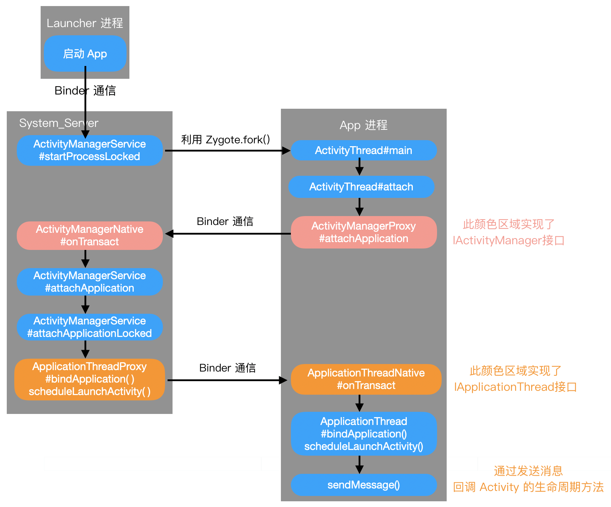

# App 启动流程

**Zygote** fork 出的第一个进程是 `system_server` 进程

而且 fork 出的**第一个 App 进程**是 `Launcher`，就是用户看到的桌面 App

**启动流程：**

当在 Launcher 中点击目标 App 的时候，发起进程就是 `Launcher` 所在的进程，启动远程进程，利用 `Binder` 发送消息给 `system_server` 进程；

1. 启动进程的操作会先调用`ActiivityManagerService#startProcessLocked()` 方法，
    1. 内部调用 `Process.start(android.app.ActivityThread)` 而后通过**Socket** 通信告知 **Zygote 进程 fork 出 app 进程**。
    2. 进程创建后将ActivityThread 加载进去，执行`ActivityThread#main()`方法。
2. 在 app 进程中，`ActivityThread#main()` 方法会实例化 **ActivityThread**，同时创建 **ApplicationThread，Looper，Handler** 对象
    1. 调用 `ActivityThread#attach()` 方法进行 **Binder** **通信**，looper 启动循环。方法内部通过 `ActivityManagerProxy#attachApplication(mAppThread)` 方法，将 thread 信息告知 AMS。
3. 在 system_server 进程中，AMS 中会调用`ActivityManagerNative#onTransact()`，
    1. 真正的逻辑在服务端 `ActiivityManagerService#attachApplication()` 方法中，
    2. 内部调用 `ActiivityManagerService#attachApplicationLocked()`方法，
    3. 方法的参数是 IApplicationThread，在此处是 `ApplicationThreadProxy` 对象，用于跟前面通过 Process.start() 所创建的进程中 ApplicationThread 对象进行通信。此方法会处理 Provider, Activity, Service, Broadcast 相应流程，调用`ApplicationThreadProxy#bindApplication()`方法，
    4. 通过 **Binder 通信**，传递给 `ApplicationThreadNative#onTransact()` 方法。
4. 在 app 进程中，真正的逻辑在 `ApplicationThread#bindApplication()` 方法中。主要功能是依次向主线程发送消息 `H.SET_CORE_SETTINGS`  和 `H.BIND_APPLICATION`。后续创建 Application, Context 等。Activity 的各种回调也会是通过 Binder 通信，然后发送不同消息处理。