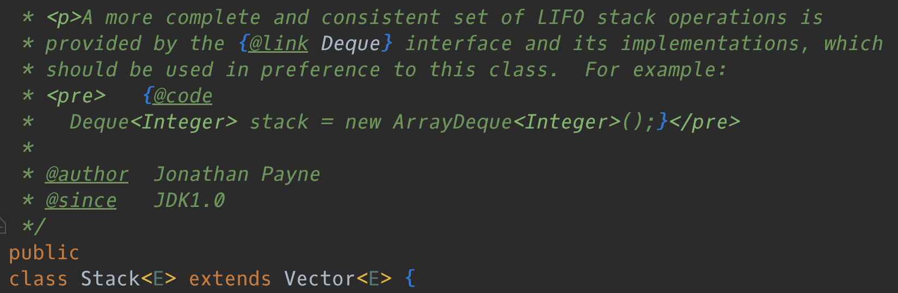

# ArrayList、LinkedList、Vector

### 数据结构基础

数组和链表是线性存储结构的**基础**，栈和队列是线性存储结构的**应用**

用 Java 实现以下数据结构

[单向链表](https://www.notion.so/ac525334-1fa2-430b-890e-56c51c824512)

[栈和队列](https://www.notion.so/60ef4af6-b0e8-427e-b946-9b3fca645891)

---

### 常见知识点总结

**ArrayList**

- 底层实现是数组
- 默认初始化的容量是 10，每次扩容以 50% 增长，也就是变为原来的 1.5 倍
- 在增删的时候，需要数组的拷贝方法 `arraycopy()`，由 C/C++ 编写的 native 方法
- 删除元素时不会减少容量，若希望减少容量则调用 `trimToSize()`
- 不是线程安全的，可以存放 `null` 值（可以在删除元素的时候存放 `null` 让 GC 回收）

**LinkedList**

- 底层实现是双向链表（方便实现往前遍历）
- 同时实现了 `List` 接口和 `Deque` 接口，既可以看作是一个顺序容器，又可以看作是一个队列，同时又可以看作一个栈。Java 官方已经声明不建议使用 `Stack` 类，首选 `ArrayDeque`，它有着比 `LinkedList` （当作栈或者队列使用时）更好的性能

Stack 的源码注释介绍了使用 ArrayDeque 代替 Stack

**Vector**

- 底层是数组，现在已少用，被 **ArrayList** 代替，原因有两个：
    1. **Vector** 所有的方法都是同步的，有性能损失。实际应用中都是需要加锁或同步的地方，所有方法一起加锁同步，避免额外的锁。
    2. **Vector** 初始长度是 10，扩容时以 100 %比率增长，比 **ArrayList** 多消耗内存

查询多用 **ArrayList**，增删多用 **LinkedList** （数据量大的极端情况）

- 如果增删元素都是末尾的话，**ArrayList** 要快，因为此时不需要复制移动位置
- 如果增删元素在中间位置的话，也是 **ArrayList** 要快，毕竟极端情况才会选择 **LinkedList**