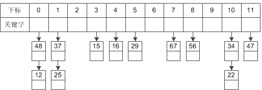

# HashMap 与哈希表、红黑树

`Set` 集合实际上就是用 `HashMap` 构建的

需要掌握的数据结构基础

[单向链表](https://www.notion.so/ac525334-1fa2-430b-890e-56c51c824512)

[栈和队列](https://www.notion.so/60ef4af6-b0e8-427e-b946-9b3fca645891)

[二叉树](https://www.notion.so/7820e85d-7b9c-4c9b-84f0-858197734cbd)

---

### 散列表（哈希表 Hash Table）

链表和数组是有序的（存储的顺序和取出的顺序是一致的），所以缺点就是，想要获取某个元素，需要遍历所有元素，知道找到为止。

**散列表**不在意元素的顺序，**能够快速查找元素**。

散列表通过**哈希函数**为每一个对象（对象的存储地址、字段等）映射成一个数值，称为**散列码**，根据散列码将对象保存在对应的位置上。`"Lee" → 76268`

- 常见的哈希函数：
    - 直接定址法：直接以关键字k或者k加上某个常数（k+c）作为哈希地址。
    - 数字分析法：提取关键字中取值比较均匀的数字作为哈希地址。
    - 除留余数法：用关键字k除以某个不大于哈希表长度m的数p，将所得余数作为哈希表地址。
    - 分段叠加法：按照哈希表地址位数将关键字分成位数相等的几部分，其中最后一部分可以比较短。然后将这几部分相加，舍弃最高进位后的结果就是该关键字的哈希地址。
    - 平方取中法：如果关键字各个部分分布都不均匀的话，可以先求出它的平方值，然后按照需求取中间的几位作为哈希地址。
    - 伪随机数法：采用一个伪随机数当作哈希函数。

哈希函数 `hashCode()` 并不是完美的，不同对象的散列码相同，就会出现「碰撞」，这种情况是无法避免的，称之为**散列冲突**。

- 常见的冲突解决方法
    - 开放定址法：一旦发生了冲突，就去寻找下一个空的散列地址，只要散列表足够大，空的散列地址总能找到，并将记录存入。
    - **链地址法**：将哈希表的每个单元作为链表的头结点，所有哈希地址为i的元素构成一个同义词链表。即发生冲突时就把该关键字链在以该单元为头结点的链表的尾部。
    - 再哈希法：当哈希地址发生冲突用其他的函数计算另一个哈希函数地址，直到冲突不再产生为止。
    - 建立公共溢出区：将哈希表分为基本表和溢出表两部分，发生冲突的元素都放入溢出表中。

**链地址法解决散列冲突**：将所有关键词为同义词的记录存储在一个单链表中，我们称这种表为**同义词表**，而散列表只存储所有同义词表的头指针。

对于关键字集合 {12,67,56,16,25,37, 22,29,15,47,48,34}，我们用 12 为除数，进行除留余数法：

无论有多少个冲突，都是在给当前的单链表增加新节点而已

### HashMap 的数据结构

在Java中，保存数据有两种比较简单的数据结构：数组和链表。数组的特点是：寻址容易，插入和删除困难；而链表的特点是：寻址困难，插入和删除容易。上面我们提到过，常用的哈希函数的冲突解决办法中有一种方法叫做链地址法，其实就是将数组和链表组合在一起，发挥了两者的优势，我们可以将其理解为链表的数组。

左边很明显是个数组，数组的每个成员是一个链表

1. **[hash 算法](https://www.hollischuang.com/archives/2091)：** 方法的输入应该是个 Object 类型的Key，输出应该是个 int 类型的数组下标。我们只要调用 Object 的 `hashCode()` 方法，返回一个整数，然后用这个数对 HashMap 或 HashTable 的容量进行取模就行了。具体的实现有两个方法

        //HashMap In Java 7
        
        final int hash(Object k) {
            int h = hashSeed;
            if (0 != h && k instanceof String) {
                return sun.misc.Hashing.stringHash32((String) k);
            }
        
        		//这段代码是为了对 key 的 hashCode 进行**扰动计算**，
        		//防止不同 hashCode 的高位不同但低位相同导致的 hash 冲突。
        		//简单点说，就是为了把高位的特征和低位的特征组合起来，降低哈希冲突的概率，
        		//也就是说，尽量做到任何一位的变化都能对最终得到的结果产生影响。
        		h ^= k.hashCode();
            h ^= (h >>> 20) ^ (h >>> 12);
            return h ^ (h >>> 7) ^ (h >>> 4);
        }
        
        //长度取模%，位运算&的效率要高，主要原因是位运算直接对内存数据进行操作，
        //不需要转成十进制，因此处理速度非常快。
        static int indexFor(int h, int length) {
            return h & (length-1);
        }

        //HashTable In Java 7
        
        private int hash(Object k) {
            // hashSeed will be zero if alternative hashing is disabled.
            return hashSeed ^ k.hashCode();
        }
        
        //没有 indexOf 代码，取而代之的是这一行代码
        //把 hash 值和 0x7FFFFFFF 做一次按位与操作
        //是为了保证得到的 index 的第一位为0，也就是为了得到一个正数
        int index = (hash & 0x7FFFFFFF) % tab.length;

    `HashTable` 默认的初始大小为 11，之后每次扩充为原来的 2n+1。这都是**素数、奇数。**由于 `HashTable` 会尽量使用素数、奇数作为容量的大小。当哈希表的大小为素数时，简单的**取模** 哈希的结果会更加均匀。

    - `HashMap` 默认的初始化大小为 **16**，之后每次扩充为原来的 **2 倍**。
    - `HashTable` 默认的初始大小为 **11**，之后每次扩充为原来的 **2n+1**。
    - 当哈希表的大小为素数时，简单的取模哈希的结果会更加均匀，所以单从这一点上看，**HashTable** 的哈希表大小选择，似乎更高明些。因为 hash 结果越分散效果越好。
    - 在取模计算时，如果**模数是 2 的幂**，那么我们可以直接使用位运算来得到结果，效率要大大高于做除法。所以从 hash 计算的效率上，又是 `HashMap` 更胜一筹。
    - 但是，`HashMap` 为了提高效率使用位运算代替哈希，这又引入了哈希分布不均匀的问题，所以 `HashMap` 为解决这问题，又对 hash 算法做了一些改进，进行了扰动计算。
2. **put()**
    1. 对 key 的 hashCode() 做 hash，然后再计算 index;
    2. 如果没碰撞直接放到 bucket 里；
    3. 如果碰撞了，以链表的形式存在 buckets 后；
    4. 如果碰撞导致链表过长(大于等于 TREEIFY_THRESHOLD )，就把链表转换成红黑树；
    5. 如果节点已经存在就替换 old value (保证 key 的唯一性)
    6. 如果 bucke t满了(超过 load factor * current capacity )，就要 resize。
3. **get()**
    1. bucket 里的第一个节点，直接命中；
    2. 如果有冲突，则通过 key.equals(k) 去查找对应的 entry 
        - 若为树，则在树中通过 key.equals(k) 查找，O(logn)；
        - 若为链表，则在链表中通过 key.equals(k) 查找，O(n)。
4. **如何 resize**

    map 里的元素个数 (`size`) 大于一个阈值 (`threshold`) 时，map 将自动扩容，容量扩大到原来的2倍；

        threshold = (int)(capacity * loadFactor);
        // **阈值 = 容量 X 负载因子**

    扩容是一个非常耗时的过程，因为它需要重新计算这些数据在新 table 数组中的位置并进行复制处理。

        void resize(int newCapacity) {   //传入新的容量
            Entry[] oldTable = table;    //引用扩容前的Entry数组
            int oldCapacity = oldTable.length;         
            if (oldCapacity == MAXIMUM_CAPACITY) {  //扩容前的数组大小如果已经达到最大(2^30)了
                threshold = Integer.MAX_VALUE; //修改阈值为int的最大值(2^31-1)，这样以后就不会扩容了
                return;
            }
        
            Entry[] newTable = new Entry[newCapacity];  //初始化一个新的Entry数组
            transfer(newTable);                         //！！将数据转移到新的Entry数组里
            table = newTable;                           //HashMap的table属性引用新的Entry数组
            threshold = (int)(newCapacity * loadFactor);//修改阈值
        }
        
        void transfer(Entry[] newTable) {
            Entry[] src = table;                   //src引用了旧的Entry数组
            int newCapacity = newTable.length;
            for (int j = 0; j < src.length; j++) { //遍历旧的Entry数组
                Entry<K,V> e = src[j];             //取得旧Entry数组的每个元素
                if (e != null) {
                    src[j] = null;//释放旧Entry数组的对象引用（for循环后，旧的Entry数组不再引用任何对象）
                    do {
                        Entry<K,V> next = e.next;
                        int i = indexFor(e.hash, newCapacity); //！！重新计算每个元素在数组中的位置
                        e.next = newTable[i]; //**标记[1]**
                        newTable[i] = e;      //将元素放在数组上
                        e = next;             //访问下一个Entry链上的元素
                    } while (e != null);
                }
            }
        }

    **注释标记[1]处**，将 `newTable[i]` 的引用赋给了 `e.next`，也就是使用了单链表的头插入方式，同一位置上新元素总会被放在链表的头部位置；这样先放在一个索引上的元素终会被放到 Entry 链的尾部(如果发生了 hash 冲突的话)； `indexFor()` 是计算每个元素在数组中的位置，源码：

        static int indexFor(int h, int length) {
            return h & (length-1); //位AND计算
        }

    这样，在旧数组中同一条 `Entry` 链上的元素，通过重新计算索引位置后，有可能被放到了新数组的不同位置上； 

    例如，

    - 旧数组容量为 16，对象 A 的 `hash` 值是 4，对象 B 的 `hash` 值是20,对象 C 的 hash 值是36； 通过 `indexFor()` 计算后，A、B、C对应的数组索引位置分别为4,4,4; 说明这3个对象在数组的同一位置上，形成了 Entry 链；
    - 旧数组扩容后容量为16*2，重新计算对象所在的位置索引，A、B、C对应的数组索引位置分别为4,20,4; B对象已经被放到别处了；

     总结：`resize` 时，HashMap 使用新数组代替旧数组，对原有的元素根据hash值重新就算索引位置，重新安放所有对象；`resize` 是耗时的操作。

---

### 红黑树

在Java 8 之前，`HashMap` 和其他基于 map 的类都是通过**链地址法**解决冲突，它们使用单向链表来存储相同索引值的元素。在最坏的情况下，这种方式会将 `HashMap` 的 **get 方法的性能从 O(1) 降低到 O(n)**。为了解决在频繁冲突时`HashMap` 性能降低的问题，Java 8 中使用**平衡树**来替代链表存储冲突的元素。这意味着我们可以将最坏情况下的性能从 **O(n) 提高到 O(logn)**