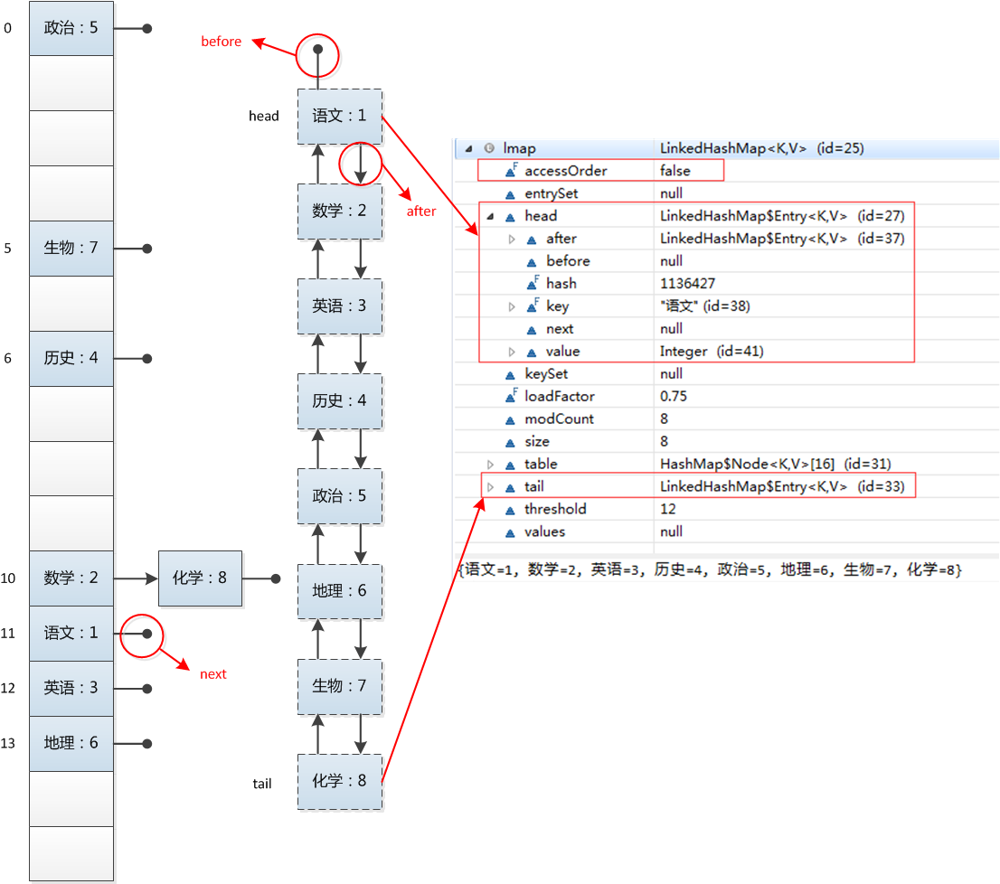

# LinkedHashMap

HashMap 为「数组 + 单向链表」，LinkedList 为「双向链表」，
而 LinkedHashMap 则使用 HashMap 存储数据，使用 LinkedList 存储数据**顺序**

**3 个重点实现的函数**

HashMap 中提到了下面的 3 个函数定义

    void afterNodeAccess(Node<K,V> p) { } // 节点访问后
    void afterNodeInsertion(boolean evict) { } // 节点插入后
    void afterNodeRemoval(Node<K,V> p) { } // 节点移除后

LinkedHashMap 继承于 HashMap，因此也实现了这 3 个函数

    //此方法在 put和 get 时候调用
    void afterNodeAccess(Node<K,V> e) { // move node to last
        LinkedHashMap.Entry<K,V> last;
        // 如果定义了 accessOrder，那么就保证最近访问节点放到最后
        if (accessOrder && (last = tail) != e) {
            LinkedHashMap.Entry<K,V> p =
                (LinkedHashMap.Entry<K,V>)e, b = p.before, a = p.after;
            p.after = null;
            if (b == null)
                head = a;
            else
                b.after = a;
            if (a != null)
                a.before = b;
            else
                last = b;
            if (last == null)
                head = p;
            else {
                p.before = last;
                last.after = p;
            }
            tail = p;
            ++modCount;
        }
    }
    
    // 此方法在 put 时候调用，LinkedHashMap 没有重写 HashMap 的 put 方法
    void afterNodeInsertion(boolean evict) { // possibly remove eldest
        LinkedHashMap.Entry<K,V> first;
        // 如果定义了移除规则，则执行相应的移除
        if (evict && (first = head) != null && removeEldestEntry(first)) {
            K key = first.key;
            removeNode(hash(key), key, null, false, true);
        }
    }
    
    // 此方法在 removeNode 后调用
    void afterNodeRemoval(Node<K,V> e) { // unlink
        // 从链表中移除节点
        LinkedHashMap.Entry<K,V> p =
            (LinkedHashMap.Entry<K,V>)e, b = p.before, a = p.after;
        p.before = p.after = null;
        if (b == null)
            head = a;
        else
            b.after = a;
        if (a == null)
            tail = b;
        else
            a.before = b;
    }

**put 和 get 函数**

LinkedHashMap 未重写 HashMap 的 put 方法，只是实现了其 put 里的 `afterNodeAcces()` 和 `afterNodeInsertion()`

get 方法被重写了，并且加入了 `afterNodeAccess()` 来保证访问顺序

    public V get(Object key) {
        Node<K,V> e;
        if ((e = getNode(hash(key), key)) == null)
            return null;
        if (accessOrder)
            afterNodeAccess(e);
        return e.value;
    }

[LinkedHashMap 实现 LRU Cache](https://www.notion.so/32e3a2de006d49689ea7039e647f51fe)