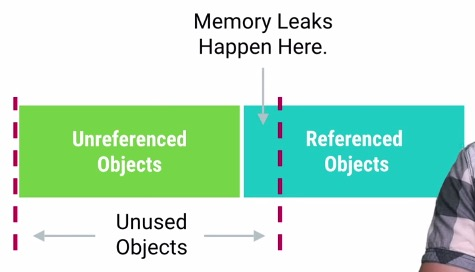

# 内存泄漏

## 定义

**内存泄漏表示的是不再用到的对象因为被错误引用而无法进行回收。**

发生内存泄漏会导致 Memory Generation 中的剩余可用 Heap Size 越来越小，这样会导致频繁触发 GC，更进一步引起性能问题。

举例内存泄漏，下面 `init()` 方法来自某个自定义 View：

    private void init() {
    	ListenerCollector collector = new ListenerCollector();
    	collector.setListener(this, mListener);
    }

上面的例子容易存在内存泄漏，如果 activity 因为设备翻转而重新创建，自定义的 View 会自动重新把新创建出来的 mListener 给绑定到 ListenerCollector 中，但是当 activity 被销毁的时候，mListener 却无法被回收了。

## 避免 views 的内存泄漏

### 1. 避免使用异步回调

异步回调被执行的时间不确定，很有可能发生在 activity 已经被销毁之后，这不仅仅很容易引起crash，还很容易发生内存泄露。

### 2. 避免使用 Static 对象

因为 static 的生命周期过长，使用不当很可能导致 leak，在 Android 中应该尽量避免使用 static 对象。

### 3. 避免把View添加到没有清除机制的容器里面

假如把view添加到[WeakHashMap](http://stackoverflow.com/questions/5511279/what-is-a-weakhashmap-and-when-to-use-it)，如果没有执行清除操作，很可能会导致泄漏。

